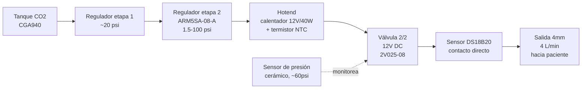
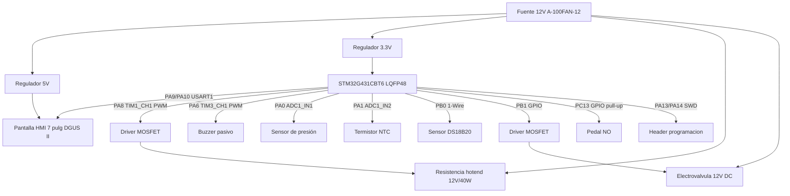

# Diagrama de bloques — Bloque 1.5

**Documento:** DIA-001 | **Revisión:** 00

## Diagrama 1: Cadena de gas (flujo físico)

## Diagrama 2: Arquitectura eléctrica/control

## Notas
Ambos diagramas reflejan el mapeo de pines validado en STM32CubeMX (ver docs/03-arquitectura-hardware.md, sección "Mapeo de pines"). El fusible térmico de hardware en serie con la resistencia y las etapas de regulación de presión redundantes se documentan en detalle en docs/03-arquitectura-hardware.md, aquí se muestran simplificados para claridad visual.
